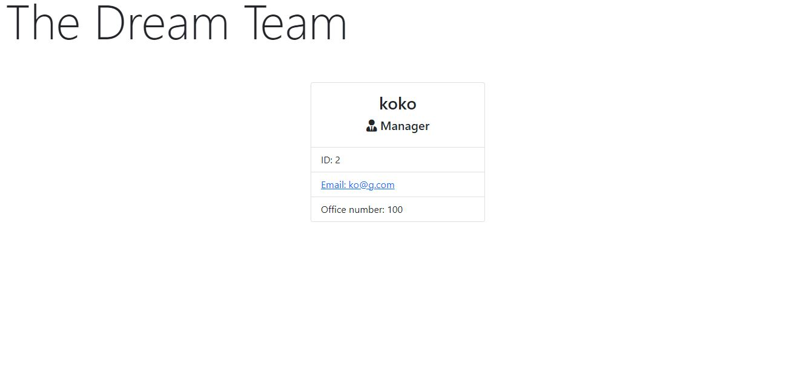
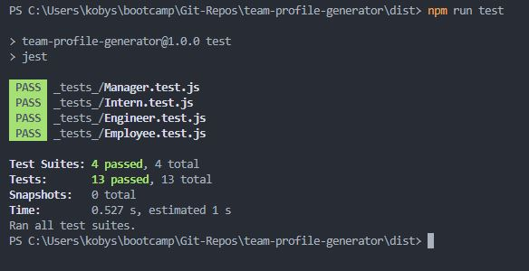

# Team Profile Generator

## Description

This page will serve as a profile for your team

## Table of contents

-[Installation](#Installation) -[Usage](#Usage) -[Credits](#Credits)

## Installation

This page shows the coding repository: https://github.com/KobyS82/Team-Profile-Generator

## Usage

To start to use this application you must copy down the repository.
First you must install the dependancies with "npm i" inside of the integrated terminal.
Next, run the tests to make sure that the application will run correctly using "npm run test".
To run the app, use "node ./index.js".
Proceed to answer the questions for your team.
Lastly, open your newly generated html file in your default browser by right clicking the file.

## Credits

Jon Deavers, for Inquirer help, https://www.educative.io/answers/how-to-use-the-inquirer-node-package

Caitlyn Swickard, for html generation, https://caitlinswickard.com/team-profile-generator/

Nicole, for jest help, https://github.com/nicolewallace09
